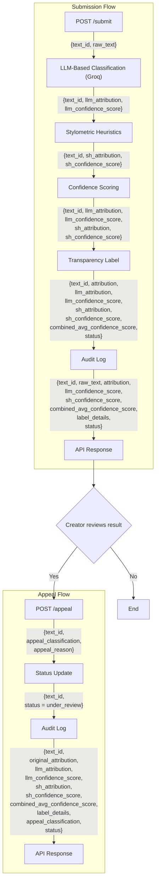

## Basic Design Overview

### Detection Signals
#### LLM-based classification (Groq)
**What property of the text it measures**: Assess whether the text reads as human or AI generated based on the overall semantic, structural, and stylistic patterns
**What does the output look like**: between 0.00 - 1.00

#### Stylometric heuristics

**What property of the text it measures**: Measures statistical properties of the writing - which includes sentence length variable, typo-token ratio (vocabulary diversity), punctuation density, or average sentence complexity
**What does the output look like**: between 0.00 - 1.00

**How will the scores be combined**: The final score will be calculated using a weighted average, using the following:
combined*score = (0.6 * llm*ai_score) + (0.4 * stylometric_ai_score)

### Uncertainty representation

A confidence score of 0.6 means that the current available evidence only moderately supports the current attribution. The detection signals show there are some characteritics of AI generated writing, but they don't agreely strongly enough to make a confident decision. This will be treated as "uncertain".
Each detection signal independently produces an AI-likelihood score between 0 and 1.
The system combines the scores using a weighted average. The resulting average value becomes the final confidence score used to determine the transparency label.
Below is the confidence threshold table to differentiate between "likely AI". "uncertain", and "likely human":
| Combined Score | Transparency Label | Meaning |
| --------------: | ------------------------ | ------------------------------------------------------------------------------------------------------- |
| **0.75 – 1.00** | **Likely AI-generated** | Strong evidence from both detection signals supports AI attribution. |
| **0.40 – 0.74** | **Uncertain** | Evidence is mixed or only moderately supports one attribution. The system avoids making a strong claim. |
| **0.00 – 0.39** | **Likely Human-written** | Little evidence suggests AI generation, so the content is classified as likely human-written. |

### Transparency label design

| Label Variant              | Label Text Displayed                                                                                                                                                                                                       |
| -------------------------- | -------------------------------------------------------------------------------------------------------------------------------------------------------------------------------------------------------------------------- |
| **Likely AI-Generated**    | The system found **strong evidence** that the content was generated or substantially assisted by AI and has **high confidence**. If you believe the result is incorrect, you may submit an appeal for review.              |
| **Uncertain**              | The system found **mixed evidence**, and we couldn't confidently determine whether the content is AI-generated or human-written. If you are the creator and believe this result requires review, you may submit an appeal. |
| **Likely Human-Generated** | The system found **strong evidence** that the content was created by a human author and has **high confidence**. If you believe the result is incorrect, you may submit an appeal for review.                              |

### Appeals workflow
The creator of the content may submit an appeal if they disagree with the system's attribution result. When they submit an appeal, they to provide the following information:

- The content ID of the original submission
- The classification they believe is correct (Ex. Likely Human, Likely AI, or Uncertain)
- A written explanation describing why they believe the original classification is incorrect

When an appeal is received, the content status updates from "completed" to "under review". The appeal is linked to the original attribution decision, and recorded in the audit log. 
When a human reviewer opens the appeal queue, they will see the text_id, the raw text, the system's attribution result, the individual confidence scores produced by the LLM-based classification (Groq) and Stylometric Heuristics, the combined confidence score, the transparency label, the creator's requested classification, the creator's appeal reasoning, and the current review status.

### Anticipated edge cases
Types of content the system might handle poorly:
- A professionally edited academic essay
    - A well-edited research paper with consistent grammar, formal vocabulary, and highly structured writing. The stylometric heuristics may assign a high AI-likeness score because the text contains long, consistent sentence structures and few grammatical errors. The LLM-based classifier may also interpret the polished writing style as AI-like, even though the paper was written entirely by a human.
- A very short piece of text
    - A piece of text that may contain only one or two sentences, such as a social media caption or product review. Because both detection signals have limited information to analyze, the confidence score may be unreliable. Instead of confidently classifying the content, the system is likely to return an "Uncertain" result because there is insufficient evidence for either attribution.

## Architecture

The submission flow begins when a creator submits a piece of text through the `POST /submit` endpoint. The submitted text is analyzed by the LLM-based Classification (Groq) and Stylometric Heuristics detection signals, whose outputs are combined by the Confidence Scoring component to determine the final attribution and confidence score. The system then generates a transparency label, records the attribution decision and supporting information in the audit log, returns the API response to the creator, and allows the creator to submit an appeal if they disagree with the classification.

If the creator submits an appeal through the `POST /appeal` endpoint, they provide the classification they believe is correct along with their reasoning. The system updates the content status to **under review**, records the appeal together with the original attribution decision in the audit log, and returns an response confirming that the appeal has been successfully submitted for human review.

## AI Tool Plan
### M3 (submission endpoint + first signal)
**Which spec sections will be provided to the AI tool**
- The LLM-based classification (Groq) section, the Stylometric heuristics section, and the architecture diagram
**What will the AI be askd to generate**
- Flask app skeleton and the first signal function
**How will be the output be verified**
- A few inputs will be tested directly before wiring into the endpoint

### M4 (second signal + confidence scoring)
**Which spec sections will be provided to the AI tool**
- The LLM-based classification (Groq) section, the Stylometric heuristics section, the uncertainty representation section, and the architecture diagram
**What will the AI be askd to generate**
- The Second signal function and the confidence scoring logic
**How will be the output be verified**
- Check Do scores vary meaningfully between clearly AI and clearly human text?

### M5 (production layer):
**Which spec sections will be provided to the AI tool**
- The label variants in the Transparency label design section, appeal workflow, and the architecture diagram
**What will the AI be askd to generate**
- The Label generation logic and the /appeal endpoint
**How will be the output be verified**
- Test if all three label variants are reachable and if an appeal updates status correctly and as intended

