## Basic Design Overview
### Detection Signals
What are your 2+ signals? What does each one measure? What does each signal's output look like (a score between 0–1? a binary flag?), and how will you combine them into a single confidence score?

### Uncertainty representation
What does a confidence score of 0.6 mean to your system? How will you map raw signal outputs to a calibrated score? What threshold separates "likely AI" from "uncertain" from "likely human"?

### Transparency label design
What exact text will the label show for a high-confidence AI result? A high-confidence human result? An uncertain result? Write out the three label variants now, before you build the UI.

### Appeals workflow
Who can submit an appeal? What information do they provide? What does the system do when an appeal is received — what status changes, what gets logged? What would a human reviewer see when they open the appeal queue?

### Anticipated edge cases
What types of content will your system handle poorly? Name at least two specific scenarios — not generic risks like "inaccurate detection," but specific cases like "a poem with heavy use of repetition and simple vocabulary that your heuristics might score as AI-generated."

## Architecture

```mermaid
flowchart LR

subgraph Submission_Flow["Submission Flow"]

A["POST /submit"]

B["LLM-Based Classification (Groq)"]

C["Stylometric Heuristics"]

D["Confidence Scoring"]

E["Transparency Label"]

F["Audit Log"]

G["API Response"]

A -->|"{text_id, raw_text}"| B

B -->|"{text_id, llm_attribution,<br/>llm_confidence_score}"| C

C -->|"{text_id, sh_attribution,<br/>sh_confidence_score}"| D

D -->|"{text_id,<br/>llm_attribution,<br/>llm_confidence_score,<br/>sh_attribution,<br/>sh_confidence_score}"| E

E -->|"{text_id, raw_text,<br/>attribution,<br/>llm_confidence_score,<br/>sh_confidence_score,<br/>combined_avg_confidence_score,<br/>label_details,<br/>status}"| F

F -->|"{text_id,<br/>attribution,<br/>llm_attribution,<br/>llm_confidence_score,<br/>sh_attribution,<br/>sh_confidence_score,<br/>combined_avg_confidence_score,<br/>status}"| G

end

G -. "Creator chooses to appeal" .-> H

subgraph Appeal_Flow["Appeal Flow"]

H["POST /appeal"]

I["Status Update"]

J["Audit Log"]

K["API Response"]

H -->|"{text_id,<br/>appeal_classification,<br/>appeal_reason}"| I

I -->|"{text_id,<br/>original_attribution,<br/>status = under_review}"| J

J -->|"{text_id,<br/>original_attribution,<br/>llm_attribution,<br/>llm_confidence_score,<br/>sh_attribution,<br/>sh_confidence_score,<br/>combined_avg_confidence_score,<br/>label_details,<br/>appeal_classification,<br/>status}"| K

end
```

and a 2–3 sentence narrative describing the submission and appeal flows. 

## AI Tool Plan
### M3 (submission endpoint + first signal)
Which spec sections you'll provide to the AI tool (hint: your detection signals section + the diagram), what you'll ask it to generate (Flask app skeleton + the first signal function), and how you'll verify the output (test with a few inputs directly before wiring into the endpoint)

### M4 (second signal + confidence scoring)
Which spec sections you'll provide (detection signals + uncertainty representation + diagram), what you'll ask for (second signal function + scoring logic), and what you'll check (do scores vary meaningfully between clearly AI and clearly human text?)

### M5 (production layer):
Which spec sections you'll provide (label variants + appeals workflow + diagram), what you'll ask for (label generation logic + the /appeal endpoint), and how you'll verify (test all three label variants are reachable and that an appeal updates status correctly)

## Label Variants

## Stretch Feature
### Analytical Dashboard